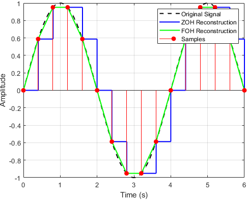

## Introduction

<b>Discipline | <b>Electrical Engineering 
:--|:--|
<b> Lab | <b> Digital Control Laboratory
<b> Experiment|     <b> Determine Frequency Response of Zero Order Hold and First Order Hold using Actual Transfer Functions and Pade Approximations and Exp 1

### About the Experiment 

In digital signal processing and control systems, converting discrete-time signals back into continuous-time signals is a critical step known as signal reconstruction.
Accurate reconstruction ensures that the continuous-time signal closely approximates the original analog signal. This process typically employs hold circuits, which either maintain or interpolate sampled data before conversion to analog form.  
 
Two common methods for reconstructing signals from samples are the Zero-Order Hold (ZOH) and First-Order Hold (FOH) techniques. 
The ZOH method reconstructs the signal by holding each sample value constant until the next sample arrives, resulting in a piecewise-constant waveform. 
Although simple and widely used, this approach can introduce signal distortion and delay. 
The FOH method improves reconstruction by linearly interpolating between samples, producing a smoother, piecewise-linear output that better approximates the original continuous-time signal.  
 
Figure 1 illustrates the discontinuous, piecewise-constant nature of the Zero-Order Hold (ZOH) output contrasted with the continuous, linearly interpolated response of the First-Order Hold (FOH), highlighting their respective influences on signal reconstruction fidelity and smoothness.    

 
<b> Fig.1. Operation of ZOH and FOH </b> 

 

This experiment further utilizes Pade approximations as an analytical tool to approximate the transfer functions of ZOH and FOH. 
These approximations provide simplified rational expressions that facilitate frequency domain analysis and insight into the dynamic characteristics of hold circuits.  
 
Determining the frequency response of these hold devices is fundamental for assessing their influence on system performance. 
This experiment involves comparing frequency responses of ZOH and FOH with those obtained through Pade approximations. 
The objective is to enhance understanding of hold device behavior and evaluate the effectiveness of Pade approximations in modeling sampled-data systems for control design.

	

<b>Subject matter expertise | <b> **Prof. Alok Kanti Deb**
:--|:--|
<b> Institute | <b>  **Indian Institute of Technology Kharagpur**
<b> Email id|     <b>  **alokkanti@ee.iitkgp.ac.in**
<b> Department |  **Department of Electrical Engineering**
<b>Webpage| <b> http://www.iitkgp.ac.in/department/EE/faculty/ee-alokkanti

### Contributors List

SrNo | Name | VLabs Developer or Integration Engineer | Designation | Department| Institute
:--|:--|:--|:--|:--|:--|
1 | **Kamal Sandeep Karreddula** | Developer | Research Scholar | Department of Electrical Engineering | IIT Kharagpur | 
2 | **Piyali Chattopadhyay** | Integration Engineer | Project Scientist | Department of Mechanical Engineering | IIT Kharagpur |

