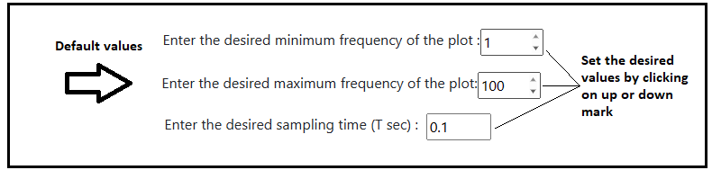
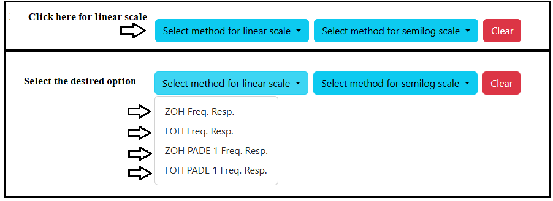
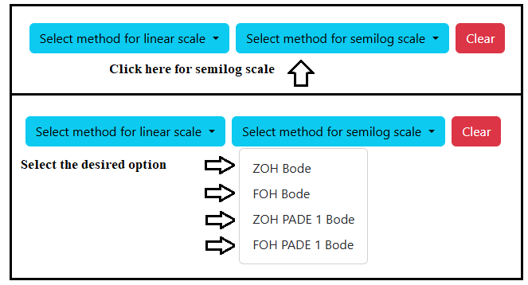

### Procedure

<b>Steps to perform the simulation</b>

										
1. At first enter the desired values of minimum frequency, maximum frequency and sampling time. Here default values are 1 for minimum frequency,
100 for maximum frequency and 0.1 for sampling frequency.

<figcaption style="color:black"> Fig.1. Maximum, Minimum Frequency and Sampling time values entry </figcaption>						  

2. Click on 'Select method for linear scale' dropdown-menu and select the desired option.

<figcaption style="color:black"> Fig.2. Selecting method for linear scale simulation </figcaption>							  

3. Click on 'Select method for semilog scale' dropdown-menu and select the desired option.

<figcaption style="color:black"> Fig.3. Selecting method for semilog simulation </figcaption>	

4. Click on 'Plot' button for simulation.

5. Click on the 'Download Plot' button to download the simulation results.

6. Click on 'Clear' button before every simulation to clear the previous plot.

