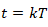
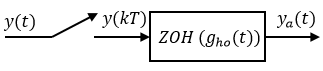
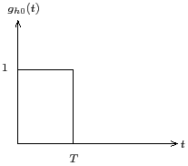
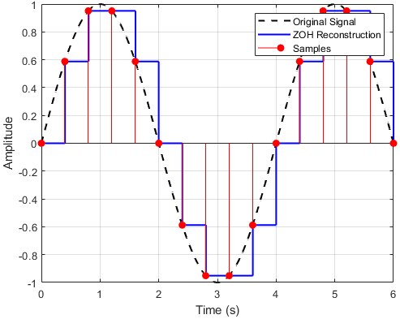
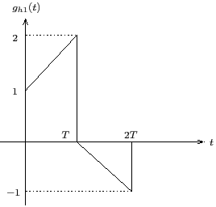
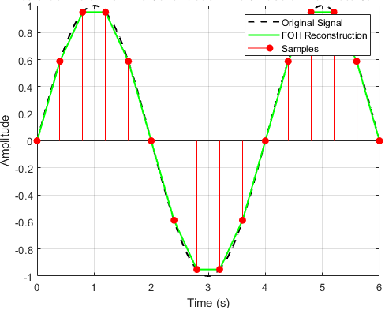

# Theory

<b>The Hold Operation</b> 
In the computer-controlled systems, it is necessary to convert the control actions calculated by the computer as a sequence of numbers, to a continuous-time signal that can be applied to the process. 

The problem of hold operation may be posed as follows:
Given a sequence {y(0), y(1), ... , 
y(k), ...},

construct ya(t), t &ge; 0.
 	  
A commonly used solution to the problem of hold operation is polynomial extrapolation. Using Taylor’s series expansion about , ya(t) can be expressed as

$$ y_a(t) = y_a(kT) + \dot y_a (kT)(t-kT)+ \frac {\ddot y_a(kT)}{2!} (t-kT)^2 +...; kT \le t \lt (k+1)T \tag{1} $$

where,

$$ \dot y_a (kT) \cong \frac{1}{T} [y_a(kT)-y_a((k-1)T)] $$

$$ \ddot y_a(kT) \cong \frac{1}{T^2} [y_a(kT)-2y_a((k-1)T)+y_a((k-2)T)] $$

If only the first term in expansion (1) is used, the data hold is called a Zero-Order Hold (ZOH). 
Here we assume that the function  ya(t) is approximately constant within the sampling interval, at a value equal to that of the function at the preceding sampling instant. 
Therefore, for a given input sequence {y(k)}, the output of ZOH is given by  

$$ y_a(t) = y(k) ; kT \le t \lt (k+1)T \tag{2} $$

The first two terms in expansion (1) are used to realize the first-order hold. For a given input sequence {y(k)}, the output of the first-order hold is given by 

$$ y_a(t) = y(k) + \frac {t-kT}{T} [y(k) - y(k-1)] \tag{3} $$

It is obvious from expansion (1) that the higher the order of the derivative to be approximated, the larger will be the number of delay pulses required. The time-delay adversely affects the stability of feedback control systems. 
Furthermore, a high-order extrapolation requires complex circuitry and results in high costs of construction. The ZOH is the simplest, and most commonly used, data hold device. 
The standard D/A converters are often designed in such a way that the old value is held constant until a new conversion is ordered.
 
 
Zero-Order Hold (ZOH) devices convert sampled signals to continuous-time signals for analyzing sampled continuous-time systems. 
The ZOH discretization of a continuous-time LTI model is depicted in the Fig. 1.  

 
<b> Fig.1. Block diagram of Zero-Order Hold with sampler</b> 

 

The ZOH device generates a continuous input signal ya(t) 
by holding each sample value y(k) constant over one sample period.  

$$ y_a(t) = y(k) ; kT \le t \le (k+1)T \tag{4} $$

 
<b> Fig.2. Impulse response of Zero-Order Hold </b> 

 

The impulse response of a ZOH, as shown in Fig. 2, can be written as

$$ g_{h0}(t) = u(t)-u(t-T) \tag{5} $$

Applying Laplace transform to (5),

$$ G_{h0}(s) = \frac{1}{s}-\frac{e^{-sT}}{s}$$

$$ G_{h0}(s) = \frac{1-e^{-sT}}{s} $$

The transfer function of ZOH is given as  

$$ G_{h0}(s) = \frac {1-e^{-sT}}{s} \tag{6} $$

 
<b> Fig.3. Operation of ZOH </b> 

 

First-Order Hold (FOH) differs from ZOH by the underlying hold mechanism. 
To turn the input samples into a continuous input, FOH uses linear interpolation between samples.  

$$ y_a(t) = y(k) + \frac {t-kT}{T} [y(k) - y(k-1)] ; kT \le t \lt (k+1)T \tag{7} $$

 
<b> Fig.4. Impulse response of First-Order Hold </b> 

 

The impulse response of a FOH, as shown in Fig. 4, can be written as 

$$ g_{h1}(t) = (1+ \frac{t}{T})[u(t)-u(t-T)]+ (1- \frac{t}{T})[u(t-T)-u(t-2T)] \tag{8} $$

$$ g_{h1}(t) = (1+ \frac{t}{T})u(t)+ (1- \frac{t}{T}-1-\frac{t}{T}) u(t-T)- (1- \frac{t}{T})u(t-2T) $$

$$ g_{h1}(t) = (1+ \frac{t}{T})u(t)- 2 \frac{t}{T} u(t-T)- (1- \frac{t}{T})u(t-2T) $$

$$ g_{h1}(t) = (1+ \frac{t}{T})u(t)- 2( \frac{t}{T}  - \frac{T}{T}+\frac{T}{T})u(t-T) - (1- \frac{t}{T}- \frac{2T}{T}+\frac{2T}{T})u(t-2T) $$

$$ g_{h1}(t) = (1+ \frac{t}{T})u(t)- 2( 1+\frac{t-T}{T})u(t-T) + (1+ \frac{t-2T}{T})u(t-2T) \tag{9} $$

Applying Laplace transform to (9),

$$ G_{h1}(s) = (\frac{1}{s}+ \frac{1}{s^2T})- 2( \frac{1}{s}e^{-sT}+\frac{1}{s^2T}e^{-sT}) + (\frac{1}{s}e^{-2sT}+\frac{1}{s^2T}e^{-2sT})  $$

$$ G_{h1}(s) = (\frac{1}{s}+ \frac{1}{s^2T})(1- 2e^{-sT} + e^{-2sT})  $$

$$ G_{h1}(s) = (\frac{1+sT}{T})(\frac{1-e^{-sT}}{s})^2  $$

The transfer function of FOH is given as  

$$ G_{h1}(s) = (\frac {1+Ts}{T}) \frac {(1-e^{-Ts})^2}{s^2} \tag{10} $$

 
<b> Fig.5. Operation of FOH </b> 

 

Padé approximation is a method of approximating a function using rational polynomials.

$$ f(x) \approx \frac {A_0+A_1x+A_2x^2+...+A_nx^n}{B_0+B_1x+B_2x^2+...+B_mx^m}   $$

An [n/m] Padé approximant is formed of a nth degree polynomial in the numerator
and an mth degree of polynomial in the denominator.

$$ P_{m}^{n}(x) \approx \frac {\sum_{i=0}^{n}A_i (x)^i}{\sum_{j=0}^{m}B_j (x)^j}   $$

The Padé approximation of the time-delay exponential function is written as:

$$ e^{-sT} \approx \frac {\sum_{i=0}^{n}A_i (sT)^i}{\sum_{j=0}^{m}B_j (sT)^j}   $$

where,

$$ A_i = (-1)^i \frac{(2n-i)! (n)!}{(2n)! (i)! (n-i)!}; B_j =  \frac{(2n-j)! (n)!}{(2n)! (j)! (n-j)!} $$

 

The [1/1] Padé approximation of the time-delay exponential function is written as:

$$ e^{-sT} \approx \frac {1-\frac{sT}{2}}{1+\frac{sT}{2}}   $$

Practical implementable transfer functions of ZOH and FOH are obtained using Padé approximations of time-delay exponential function.      

The transfer function of ZOH using [1/1] Padé approximation is given as  

$$ G_{h0}(s) = \frac {1-e^{-sT}}{s} \approx \frac {1-\frac {1-\frac{sT}{2}}{1+\frac{sT}{2}}}{s} $$

$$ G_{h0}(s) \approx \frac {1-\frac {2-sT}{2+sT}}{s} $$

$$ G_{h0}(s) \approx \frac {2+sT-2+sT}{s(2+sT)} $$

$$ G_{h0}(s) \approx \frac {2T}{2+sT} \tag{11} $$

Similarly, the transfer function of FOH using [1/1] Padé approximation is given as  

$$ G_{h1}(s) = (\frac {1+Ts}{T}) \frac {(1-e^{-Ts})^2}{s^2} \approx (\frac {1+Ts}{T}) \frac {(1-\frac {1-\frac{sT}{2}}{1+\frac{sT}{2}})^2}{s^2} $$

$$ G_{h1}(s) \approx (\frac {1+Ts}{T}) (\frac {2T}{2+sT})^2 \tag{12} $$               

